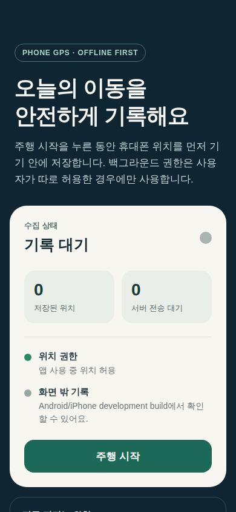
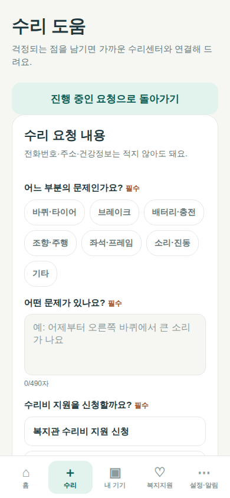
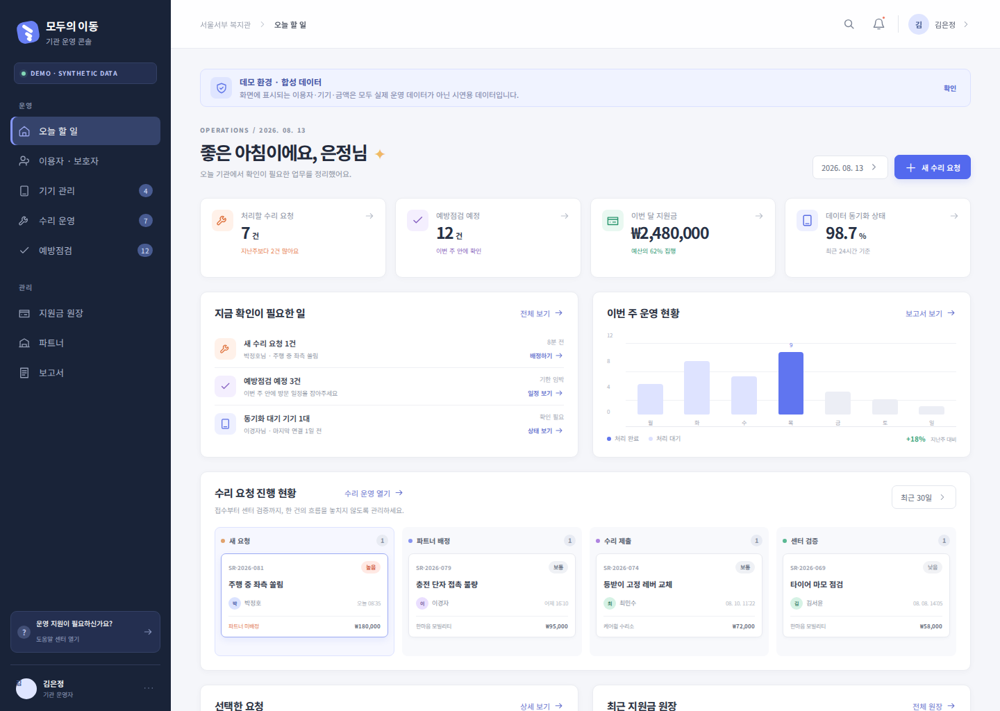
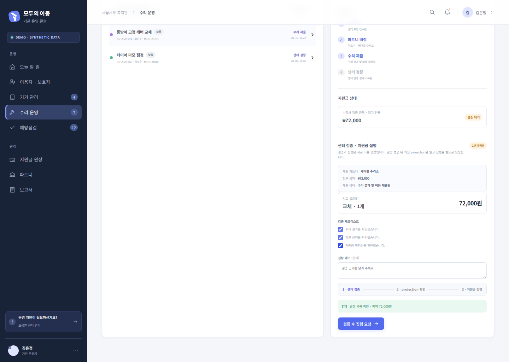
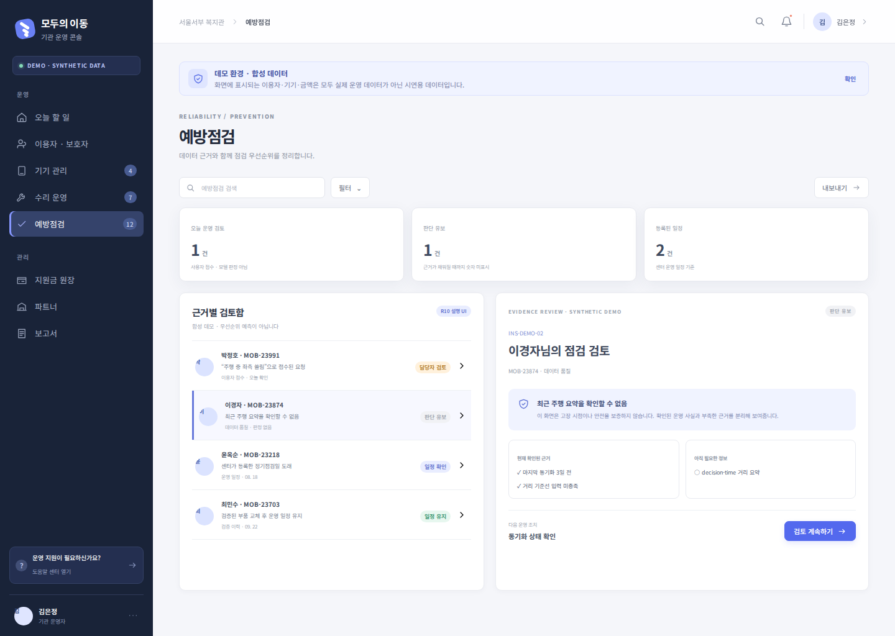
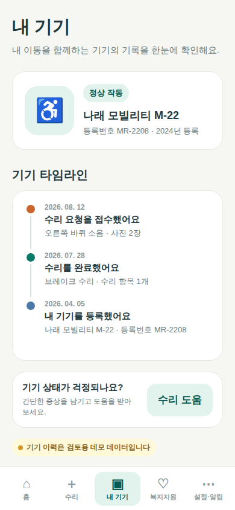
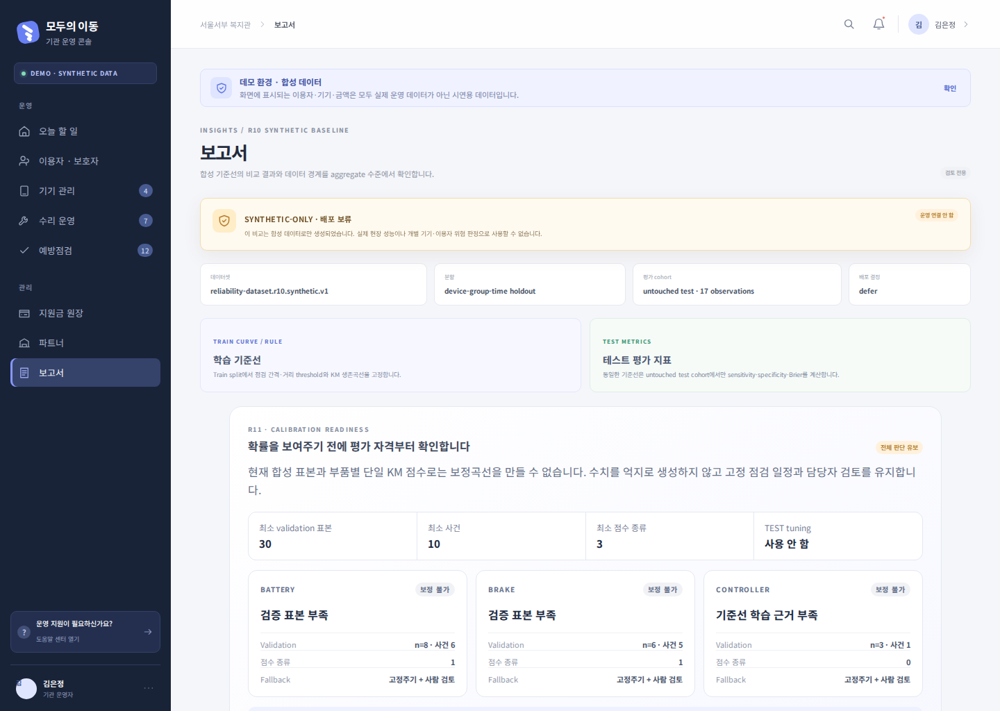
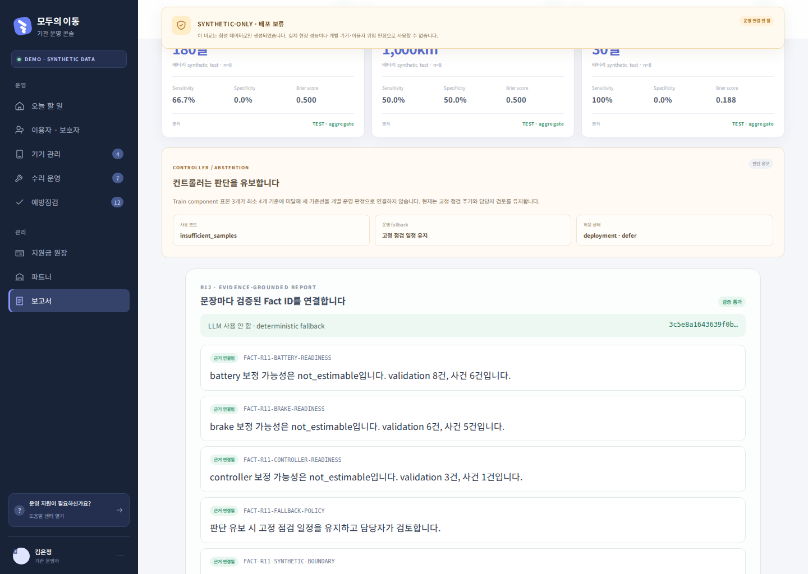

# EVD-20260820-001 — 노션 공유용 제품 화면 세트

- 생성: 2026-08-20 KST / Codex 자동 실행
- 환경·데이터: WSL2 local / deterministic synthetic demo
- source commit: `0a68452`; 실행 전 source worktree는 `../.serena/` 외 변경 없음
- 출처: `rtk pnpm exec playwright test --project=mobile-chromium --project=console-chromium`
- 상태: `generated` — 사람 검토·외부 발행 전
- 위치·접근: 저장소의 Playwright golden snapshot, repository 접근자
- 결과: 8개 test 중 7개 통과. 모바일 복합 flow의 마지막 `mobile-repairer-submit-review`만 55 pixel(`0.01`) visual diff로 실패했으며 아래 공유 세트에서 제외했다. 아래에 선택한 개별 screenshot assertion은 모두 현재 렌더와 일치했다.
- 증명: local deterministic demo UI가 지정 viewport에서 표시되고 테스트가 확인한 상태 전이가 존재함
- 한계: production Firebase, 실제 기관·이용자 데이터, native Android/iPhone, GPS lifecycle, 접근성, field 운영을 증명하지 않음
- 사용처: 2026년 8월 교수 미팅용 Notion 진행 보고. 별도 UPD·HR 발행은 하지 않음.

## 노션 본문 권장 6장

모든 화면은 실제 운영 데이터가 아닌 합성 데모다. 노션에는 첫 이미지 위나 아래에 `현재 화면은 개발·시험용 합성 데이터 기준`이라고 한 번 표시한다.

### 1. 사용자 모바일 홈

> 진행 중인 수리, 다음 약속, 수리 지원금, 기기 상태와 이동 기록을 한 화면에서 확인합니다.

### 2. 사용자 수리 요청

> 사용자가 고장 증상과 지원금 신청 여부를 선택해 수리를 요청합니다.

### 3. 수리자 현장 작업

> 수리자는 현장에서 QR 또는 공개코드로 기기를 확인한 뒤 일정과 작업 결과를 기록합니다.

### 4. 복지관 운영 대시보드

> 복지관은 신규 요청, 예정 점검, 지원금과 수리 진행 현황을 한 화면에서 관리합니다.

### 5. 센터 검증과 지원금 집행

> 수리 결과와 청구 금액을 복지관이 확인한 뒤 지원금 집행 단계로 넘깁니다.

### 6. 예방점검 근거 확인

> 데이터가 충분하지 않을 때는 고장을 단정하지 않고 판단을 유보하며 확인 근거를 함께 보여줍니다.

## 기술 설명용 추가 3장

### 7. 사용자 기기 타임라인

> 완료된 수리이력을 기기별 타임라인으로 재구성합니다.

### 8. 합성 신뢰성 분석 비교

> 고정 점검주기와 사용량·생존분석 기준선을 동일한 합성 평가셋에서 비교한 개발 화면입니다. 실제 예측 성능이 아닙니다.

### 9. 근거 연결형 보고서

> 보고서 문장을 계산 근거와 연결하고, 사람 검토 전에는 발행하지 않도록 상태를 분리했습니다.

## 업로드 시 주의

- GitHub 또는 로컬 파일에서 PNG 원본을 내려받아 노션에 직접 업로드한다.
- 화면 속 이름·금액·기기 번호는 합성 데이터지만 외부 공유 시에도 `합성 데모` 표시를 유지한다.
- 모바일은 세로폭이 길 수 있으므로 노션에서 원본 전체를 넣고, 필요하면 동일 원본을 복제해 상단 핵심 영역만 crop한다.
- AI 화면은 본문보다 기술 개발 부록에 배치한다.

