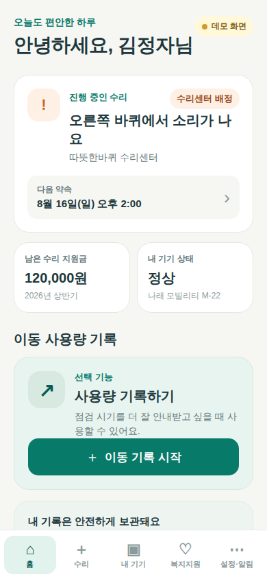
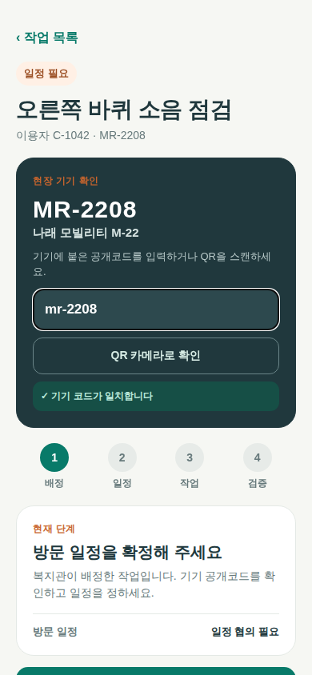
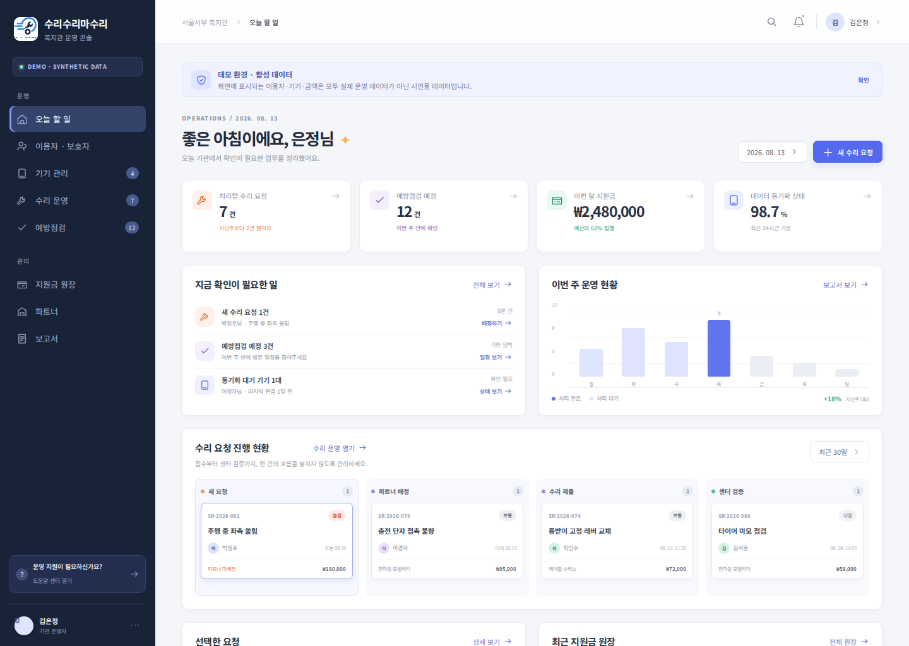
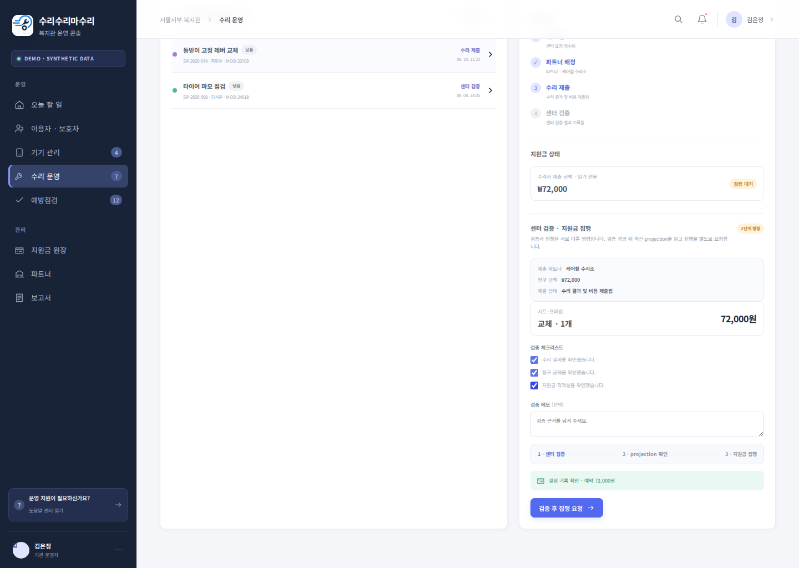
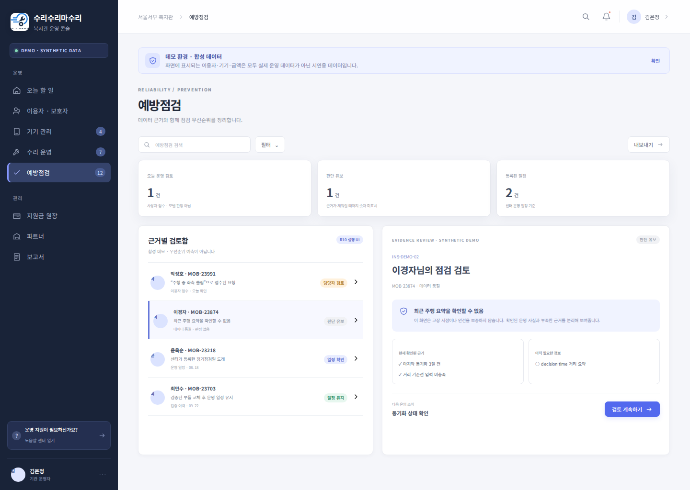
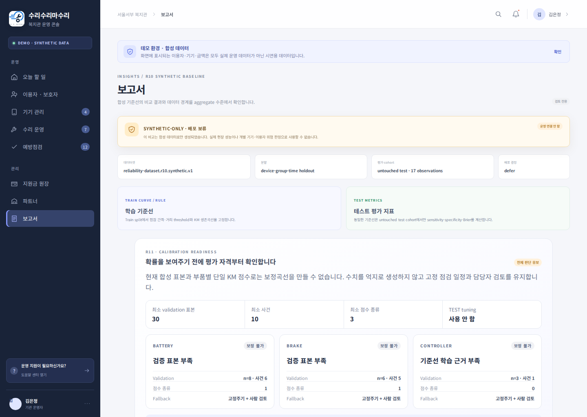
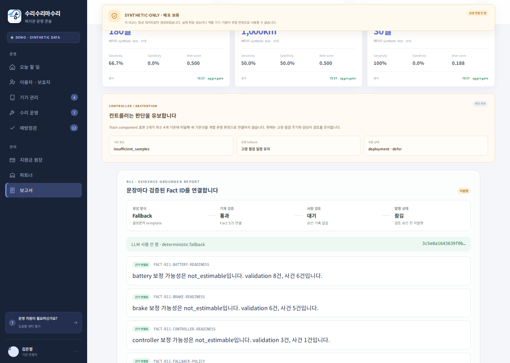

# EVD-20260820-002 — 승인 브랜드 적용 노션용 제품 화면 세트

- 생성: 2026-08-20 KST / Codex 자동 실행
- 환경·데이터: WSL2 local / deterministic synthetic demo
- source base: `d3814ef` 이후 brand correction worktree
- 상태: `generated` — 사람 검토·외부 발행 전
- 로고 원본: `attached/sources/brand/logo-original.png`, SHA-256 `282af8736c08663319978ed30e59cb170abb4efd4233d96072aeefc88119f9a8`
- 저장 사본: `apps/console/public/brand/logo-original.png`, `apps/mobile/assets/surisuri-masuri-logo-original.png`; 원본과 byte-identical
- crop: 배경 제거 없음. 콘솔 CSS overflow로 심볼 주위의 흰 여백만 가림
- 검증: console Playwright 6/6, mobile Playwright 2/2, console unit 25/25, console typecheck/build 통과
- 결과: 모바일 golden 9장과 콘솔 golden 7장이 현재 렌더와 일치함
- 불변 사본: `docs/evidence/assets/EVD-20260820-002/`; 아래 링크는 golden을 직접 가리키지 않음
- 증명: local deterministic demo UI에 승인 이름·로고가 표시되고 지정 viewport의 제품 흐름이 재현됨
- 한계: production Firebase, 실제 기관·이용자 데이터, native Android/iPhone screenshot, GPS lifecycle, 현장 운영과 상표 법률 검토를 증명하지 않음
- 관련: [ADR-0067](../decisions/ADR-0067-approved-product-brand-source.md), [UPD-20260820-01](../product-updates/UPD-20260820-01-approved-brand-and-screenshots.md)

## 노션 본문 권장 6장

첫 화면 근처에 `현재 화면은 개발·시험용 합성 데이터 기준`이라고 표시한다.

### 1. 사용자 모바일 홈

> 진행 중인 수리, 다음 약속, 수리 지원금, 기기 상태와 이동 기록을 한 화면에서 확인합니다.

### 2. 사용자 수리 요청

> 사용자가 고장 증상과 지원금 신청 여부를 선택해 수리를 요청합니다.

### 3. 수리자 현장 작업

> 수리자는 현장에서 QR 또는 공개코드로 기기를 확인한 뒤 일정과 작업 결과를 기록합니다.

### 4. 수리수리마수리 복지관 운영 대시보드

> 복지관은 신규 요청, 예정 점검, 지원금과 수리 진행 현황을 한 화면에서 관리합니다.

### 5. 센터 검증과 지원금 집행

> 수리 결과와 청구 금액을 복지관이 확인한 뒤 지원금 집행 단계로 넘깁니다.

### 6. 예방점검 근거 확인

> 데이터가 충분하지 않을 때는 고장을 단정하지 않고 판단을 유보하며 확인 근거를 함께 보여줍니다.

## 기술 설명용 추가 3장

### 7. 사용자 기기 타임라인

### 8. 합성 신뢰성 분석 비교

> 실제 예측 성능이 아니라 동일 합성 평가셋에서 기준선을 비교한 개발 화면입니다.

### 9. 근거 연결형 보고서

> 보고서 문장을 계산 근거와 연결하고 사람 검토 전에는 발행하지 않도록 상태를 분리했습니다.

## 불변 사본 SHA-256

| 파일 | SHA-256 |
| --- | --- |
| `01-mobile-home.png` | `6079eee5c6b3a0421a4fade7400c11b8a9bd517368f8916ad8ba6b8d794f3dda` |
| `02-mobile-repair-intake.png` | `271627ea2c5d91cdbd3cb7b8b4d99a1fc8eaab20b5802af6091067eb7568fbec` |
| `03-mobile-repairer-workspace.png` | `2a4cbacb047483c768ad4ff9ef9b347b425741439f33c2a387bf767f575767f3` |
| `04-console-overview.png` | `7a83b9305309581e9843be75082573c8b504a5c0707345467abc3328ee7e9e01` |
| `05-console-authority-review.png` | `f1520e354de2f20729eae265282504b94efd54e789ce92436b4af136343540a2` |
| `06-console-inspection-evidence.png` | `65a280087ff5b5c95a8d293ea5715bbd3981b0440d94acddb6012905bde61b4b` |
| `07-mobile-device-timeline.png` | `5f445f3475505a3445c78b2b1f79dba4eb34fba6a97e62cef78db0a8e5be06b2` |
| `08-console-baseline-comparison.png` | `5fae1f20e61ed7db33698c9ada3613633fee8c1ed0392714f5b179f2271a06b8` |
| `09-console-grounded-report.png` | `3ee1145a0a1e61026bc35fcd11534251644c306cf058b718c4615828fda3bbfe` |

## 업로드 시 주의

- PNG 원본을 내려받아 노션에 직접 업로드한다.
- 합성 화면임을 유지하고 실제 기관 운영 화면으로 표현하지 않는다.
- 모바일 캡처는 Expo Web의 390×844 viewport이며 iOS native screenshot이 아니다.
- 실제 iPhone 캡처는 Mac native smoke 이후 별도 증거로 교체한다.
