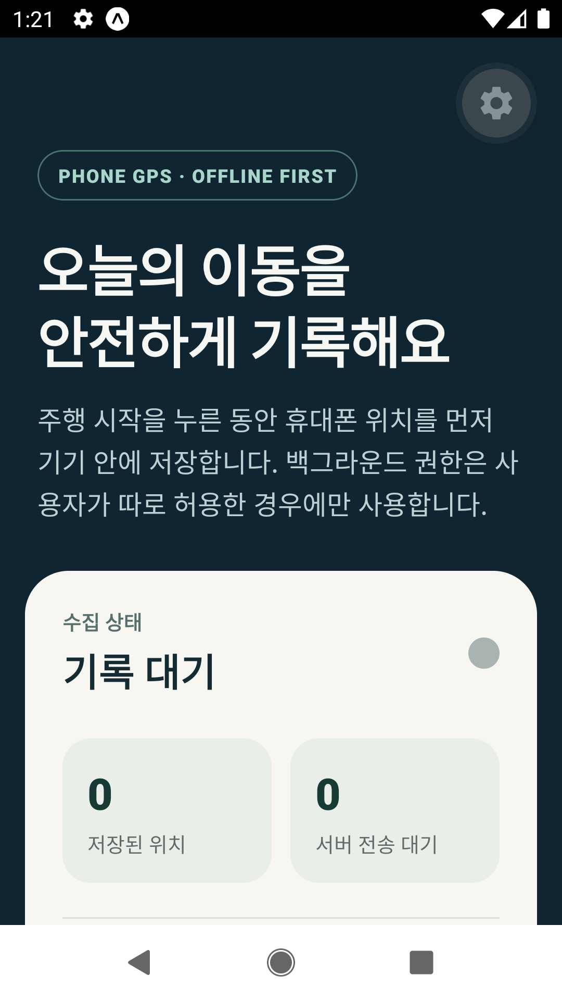
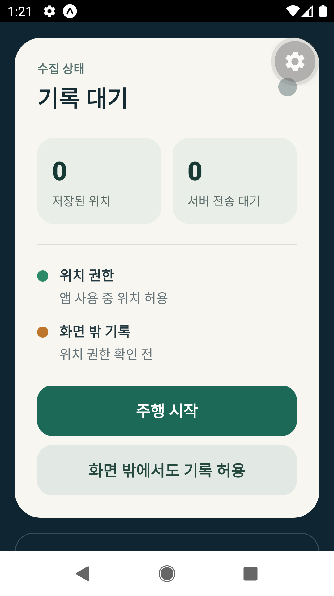
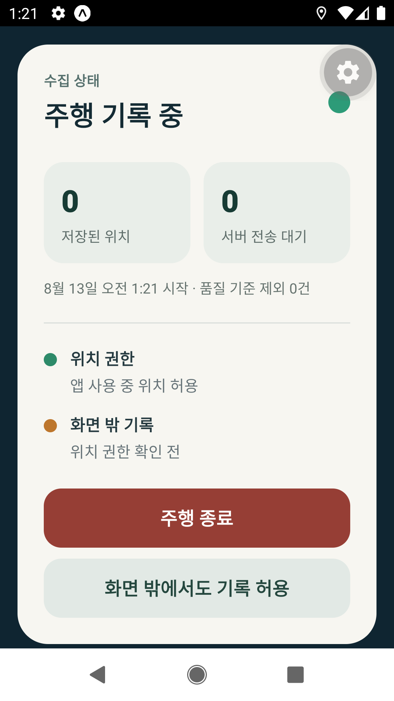
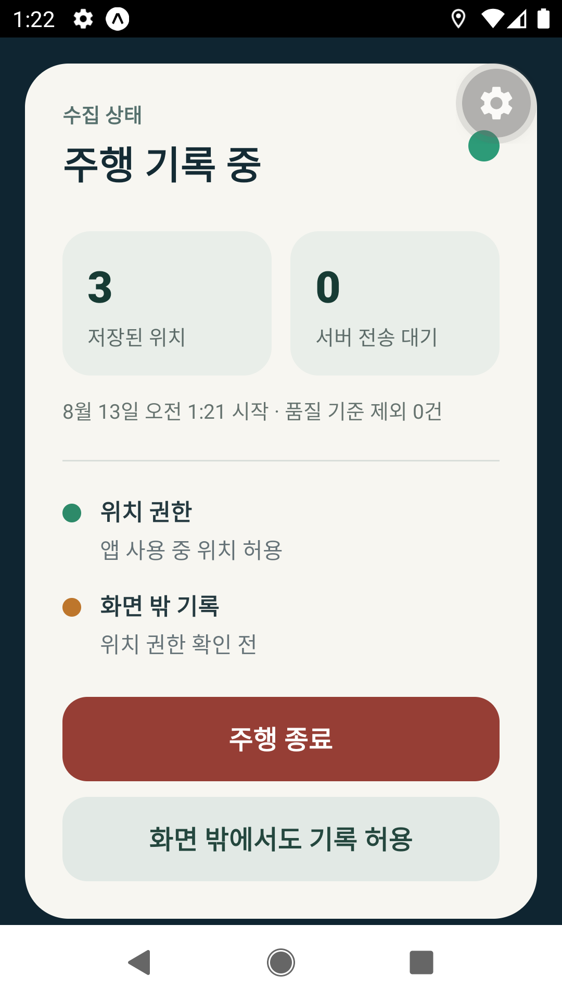

# 모바일 앱 현재 UX 감사

- 리포트 ID: `HR-20260813-04`
- 감사일: 2026-08-13
- 대상: Android Expo Go에서 실행한 `apps/mobile`
- 범위: 대기 화면 → 주행 시작 → 합성 위치 3건 수집 → 주행 종료
- 감사 방식: 실제 Android 에뮬레이터 조작과 단계별 화면 캡처
- 판정 경계: 이 문서는 현재 UI와 상호작용을 평가한다. 현장 사용자 검증이나 WCAG 준수를 증명하지 않는다.
- 증거: [EVD-20260813-004](../../evidence/2026-08.md#evd-20260813-004--현재-모바일-실제-흐름-ux-baseline)

## 총평

현재 화면은 텔레메트리 기능의 작동 여부를 확인하는 개발용 진단 화면으로는 유효하지만, 전동보장구 이용자의 일상 주행 앱으로는 부적합하다. 사용자가 가장 먼저 해야 할 `주행 시작`이 첫 화면 아래에 있고, `OFFLINE FIRST`, `저장된 위치`, `서버 전송 대기`, `품질 기준 제외`처럼 구현 내부의 개념이 핵심 정보보다 앞선다.

가장 큰 구조 문제는 다음 세 가지다.

1. 주행 시작·기록 중·종료 확인이라는 사용자 과업보다 개발 상태가 앞선다.
2. 기록 중 화면이 실제 이동에 유용한 정보 대신 위치 샘플 개수를 보여준다.
3. 종료 직후 모든 수치가 0으로 돌아가 기록이 저장됐는지 확인할 수 없다.

Expo Go의 회색 톱니 버튼은 개발 도구 오버레이이며 출시 앱 UI가 아니다. 다만 이를 제외해도 현재 본문 자체가 개발 문서처럼 구성되어 있다는 결론은 바뀌지 않는다.

## 단계별 감사

### 1. 홈 상단 — 좋지 않음

사용자 목표는 주행 기록 시작이지만 첫 화면에는 행동 버튼이 보이지 않는다. 큰 제목 아래에 권한·백그라운드 저장 설명과 0인 운영 지표가 먼저 나온다. 영어 배지 `PHONE GPS · OFFLINE FIRST`는 제품 가치가 아니라 구현 방식이며 고령 사용자가 이해해야 할 이유가 없다.

확인된 장점은 큰 제목과 비교적 넓은 여백이다. 그러나 제품명·로고·현재 기기·오늘의 상태 같은 사용자 정체성과 맥락은 없다.

### 2. 시작 제어 — 나쁨

`주행 시작` 버튼 자체는 크고 명확하다. 하지만 사용자는 버튼을 찾기 위해 수집 상태, 저장된 위치, 서버 전송 대기, 두 종류의 권한 상태를 지나 스크롤해야 한다. `화면 밖에서도 기록 허용`도 의미는 맞지만 최초 화면에서 주행 시작과 같은 무게로 노출되어 선택 부담을 만든다.

구조를 `오늘 상태 → 주행 시작 → 필요한 경우에만 권한 설명` 순서로 뒤집어야 한다. 권한은 설정 화면이나 최초 요청 직전의 짧은 안내로 이동하는 편이 맞다.

### 3. 주행 시작 직후 — 보통 이하

제목이 `주행 기록 중`으로 바뀌고 녹색 상태점과 빨간 종료 버튼이 나타나는 점은 상태 변화를 전달한다. 버튼 크기도 충분하다.

그러나 기록 중 핵심 정보가 `저장된 위치 0`, `서버 전송 대기 0`이다. 사용자는 샘플 개수가 아니라 기록이 안전하게 진행 중인지, 얼마나 이동했는지, 얼마나 지났는지, 휴대폰 화면을 꺼도 되는지를 알고 싶다. 작은 상태점만으로는 기록 지속 여부를 멀리서 확인하기 어렵다.

### 4. 위치 수집 중 — 나쁨

합성 위치 3건이 저장되자 숫자는 증가했지만, `3`이 사용자에게 어떤 의미인지 설명되지 않는다. 이는 개발 검증에는 유용하나 일상 사용에는 무의미하다. 서버 동기화가 아직 연결되지 않아 `서버 전송 대기 0`도 현재 사용자에게 잘못된 안도감이나 혼란을 줄 수 있다.

사용자 화면에서는 이 영역을 `기록 중`, `경과 시간`, `이동거리`, `기기에 안전하게 저장됨`으로 교체하고 원시 샘플·동기화 큐·거부 건수는 진단 화면으로 이동해야 한다.

### 5. 주행 종료 후 — 매우 나쁨

종료 직후 별도 확인이나 요약 없이 `기록 대기`와 0으로 돌아간다. 사용자는 방금 기록이 사라졌다고 느낄 수 있다. 이 단계는 신뢰를 가장 크게 훼손한다.

종료 후에는 최소한 `오늘 주행이 저장되었습니다`, 시작·종료 시각, 이동거리, 기록 품질, 다음 행동을 보여주는 요약 화면이 필요하다. 저장·동기화 상태는 기술 용어가 아니라 `휴대폰에 저장됨`, `전송 대기`, `기관에 전달됨`처럼 사용자 결과로 번역해야 한다.

## 접근성 위험

- 큰 제목과 54px 이상의 주요 버튼은 긍정적이다.
- 상태 색상 옆에 텍스트가 있어 색상만으로 상태를 구분하지 않는 점도 긍정적이다.
- 핵심 행동이 첫 화면 밖에 있어 운동·인지 부담이 커진다.
- 영어 및 기술 용어가 이해를 방해한다.
- 기록 중 상태와 종료 성공이 충분히 크게, 반복적으로 전달되지 않는다.
- 스크린샷만으로 TalkBack 읽기 순서, 포커스 이동, 동적 글자 크기, 대비 수치, 실제 터치 영역을 확정할 수 없다. 별도 기기 검증이 필요하다.

## 제품 방향 권고

모바일 앱의 첫 번째 출시 흐름은 세 화면이면 충분하다.

1. **오늘 화면:** 오늘의 기기 상태와 하나의 큰 `주행 시작` 버튼
2. **기록 중:** 경과 시간·이동거리·저장 상태와 명확한 `주행 종료` 버튼
3. **주행 완료:** 저장 완료 확인, 간단한 주행 요약, 필요한 경우에만 점검 알림

위치 권한, 백그라운드 권한, 원시 샘플 수, 동기화 큐, 데이터 품질 상세는 각각 최초 안내·설정·진단 화면으로 분리한다. 사용자 화면은 “수집 시스템”이 아니라 “오늘의 안전한 이동”을 설명해야 한다.

## 다음 검증

- 선택된 새 시각 방향을 React Native Web로 구현하고 Playwright로 390×844 화면 회귀 검사
- Android/iPhone에서 위치 권한, 백그라운드 전환, 앱 종료·복구를 별도 검증
- TalkBack·VoiceOver, 200% 글자 확대, 색상 대비, 한 손 조작 검사
- 실제 이용자 또는 보호자에게 `주행 시작`, `기록 확인`, `종료 후 저장 확인` 세 과업 테스트
